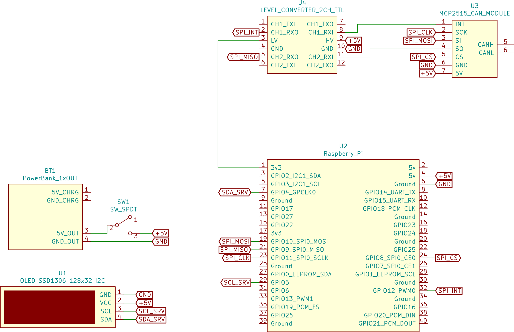

# zakhar_brain
Software for Zakhar's brain.

Part of the [Zakhar Project](https://github.com/an-dr/zakhar)

The repository is dividede by 3 subrepositories:

- [zakharos_core](https://github.com/an-dr/zakharos_core) - set of ROS-packages with main programs (using it you can run the robot's mind)
- [zakhar_pycore](https://github.com/an-dr/zakhar_pycore) - Python modules provides interaction with the hardware
- [zakhar_service](https://github.com/an-dr/zakhar_service) - repo for service, debugging and testing

## Requrements

### Hardware
- Raspberry Pi >= 2 Gb RAM (or compatible platform)
- Compatible to the following I2C-devices:
    - [an-dr/zakhar-face-module: Zakhar's part which is responsible for facial expressions](https://github.com/an-dr/zakhar-face-module) (I2C address: 0x2b)
    - [an-dr/zakhar_sensors: Sensors implementation for the Zakhar Project](https://github.com/an-dr/zakhar_sensors) (I2C address: 0x2c)
    - [an-dr/zakhar_platform: Controlled from i2c and uart moving platform for zakhar](https://github.com/an-dr/zakhar_platform) (I2C address: 0x2a)

### Software
- ROS1 noetic ([how to install](docs/ros_install.md))
- Python 3.7 or newer
- Python packages from [requirements.txt](requirements.txt)

### Dev-Software
For the development it is recommended to use VSCode with installed [recomended extensions](.vscode/extensions.json) on the Host. As for the Target it is recommended to use Raspberry Pi 4 with 2Gb and more  of RAM

## Schematic

## Copyrights

Copyright (c) 2020 Andrei Gramakov. All rights reserved.
